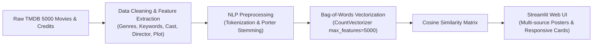

# 🍿 CineMatch AI - Intelligent Movie Recommender System


An interactive, AI-powered Content-Based Movie Recommendation Engine built with **Python**, **Scikit-Learn NLP**, and **Streamlit**. CineMatch analyzes multi-dimensional metadata (genres, plot synopsis, keywords, top cast, and director) to deliver precise movie recommendations with similarity scoring, dynamic posters, genre filters, and detailed cast metrics.

---

## 📸 Features & Highlights

- **Content-Based Filtering**: Recommends movies based on high-dimensional Cosine Similarity calculated over 5,000 metadata features.
- **⚡ Fast Multi-Source Poster Engine**: Fetches official movie artwork asynchronously with zero lag.
- **🎯 Interactive Genre Filter**: Narrow down recommendations to specific genres (*Action, Sci-Fi, Comedy, Romance, etc.*).
- **⚡ Cosine Match Score**: Displays exact percentage similarity (e.g. `94.2% Match`).
- **📱 Responsive UI**: Custom glassmorphism cinema dark theme with multi-row grid wrapping.
- **🎲 "Surprise Me" Mode**: Random movie discovery for undecided viewers.
- **📈 ML Analytics Tab**: Real-time dataset metrics, Cosine distance formula, and genre distribution charts.

---

## 🛠️ Architecture & Machine Learning Pipeline



$$\text{Cosine Similarity}(A, B) = \frac{A \cdot B}{\|A\| \|B\|} = \frac{\sum_{i=1}^{n} A_i B_i}{\sqrt{\sum_{i=1}^{n} A_i^2} \sqrt{\sum_{i=1}^{n} B_i^2}}$$

---

## 🚀 Getting Started

### 1. Clone the Repository
```bash
git clone https://github.com/Nandinimane511/movie-recommender-system.git
cd "movie recommendation project"
```

### 2. Install Dependencies
```bash
pip install -r requirements.txt
```

### 3. Download & Place Datasets
Download the [TMDB 5000 Movie Dataset](https://www.kaggle.com/datasets/tmdb/tmdb-movie-metadata) from Kaggle and place the following files into the project root directory:
- `tmdb_5000_movies.csv`
- `tmdb_5000_credits.csv`

### 4. Build the Recommendation Model
Run the preprocessing script to extract metadata and compute similarity matrices:
```bash
python preprocess.py
```

### 5. Launch the Web Application
```bash
streamlit run app.py
```
Open your browser and visit: `http://localhost:8501`

---

## 📂 Project Structure

```
├── app.py                      # Streamlit interactive web application
├── preprocess.py               # ML preprocessing, stemming & vectorization pipeline
├── notebook86c26b4f17.ipynb    # Exploratory Data Analysis & experimentation notebook
├── requirements.txt            # Project dependencies
├── .gitignore                  # Git ignore rules for datasets & models
├── README.md                   # Comprehensive project documentation
└── model/                      # Generated model pickle files (ignored by git)
    ├── movie_list.pkl
    └── similarity.pkl
```

---

## 👥 Contributors & Team

- **Nandini Mane** ([manenandini511@gmail.com](mailto:manenandini511@gmail.com))
